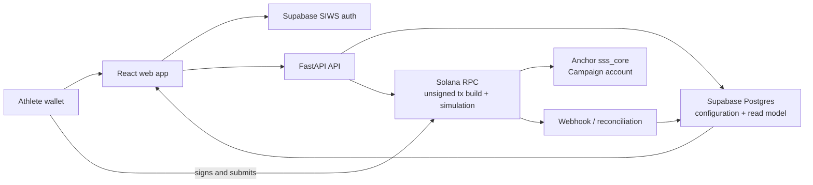

# Part 1 - Profile, Subscription Plan, and Campaign Foundation

**Status:** Proposed
**Date:** 2026-08-09
**Repository baseline:** `kls028/backr`, `main`, commit `2ae1f06`
**Source material:** `C:/Users/rishi/Downloads/onchain_arch_merged.pdf`

## 1. Purpose

This document defines the product requirements, user experience, system design, and acceptance criteria for the foundation slice of the fundraising platform. It establishes the identity and configuration records that later payment, escrow, Support Points, reward fulfillment, indexing, and vesting flows will consume.

The slice ends with an authenticated athlete able to create and publish a valid campaign configuration, and with a supporter able to browse and inspect an active campaign. It does not move USDC, issue subscription units, award Support Points, settle a campaign, or fulfill a reward.

## 2. Product context

The product lets athletes offer a monthly subscription in USDC and attach a time-bounded crowdfunding campaign to that subscription. A campaign has a fixed subscription-unit price, a minimum success threshold, a main goal, stretch goals, and individual reward tiers. Supporters will later purchase one or more subscription units; that purchase and its escrow consequences are deliberately implemented after this foundation is stable.

The current repository is a monorepo scaffold with:

- `apps/web`: React 19, Vite, React Router, shadcn/ui, Solana wallet adapter, and Supabase client.
- `services/api`: FastAPI, SQLAlchemy async sessions, Supabase JWT verification, Solana RPC helpers, and indexed counter-demo routes.
- `onchain`: Anchor workspace containing a counter demo that must be replaced by the campaign account and initialization instruction.
- `supabase/migrations`: authoritative Postgres schema source.
- `packages/idl`: generated Anchor IDL boundary.

The existing authentication and custody invariants remain binding:

1. The program owns financial truth. Postgres stores configuration and a derived read model, not an authoritative balance or settlement result.
2. The backend never holds a user key. It builds and simulates unsigned transactions; the browser wallet signs and submits them.
3. Every ingest and confirmation write is idempotent.
4. `supabase/migrations` is the only schema authority; SQLAlchemy models mirror it manually.
5. Authentication and webhook writes fail closed.

## 3. Goals and non-goals

### Goals

- Make a wallet-authenticated user a supporter by default.
- Allow a supporter to activate an athlete profile and create campaigns.
- Store the athlete profile data needed for campaign presentation.
- Create one published subscription plan per athlete for the initial release.
- Create, edit, validate, publish, schedule, cancel, and read campaign configuration.
- Snapshot the subscription-unit price into a campaign so later plan-price changes cannot alter an active campaign.
- Put the campaign's financial thresholds and schedule into an Anchor account at publication time.
- Keep rich text, reward descriptions, and media references in off-chain metadata with a content hash recorded alongside the on-chain account.
- Expose typed API and UI contracts that later purchase and settlement work can build on.
- Make every state transition observable and testable.

### Non-goals

- USDC transfer, token-account validation, payment verification, or escrow.
- Subscription-unit activation or expiration calculation.
- Support Points, campaign success bonuses, cosmetics, athlete stores, or reward orders.
- Campaign settlement, refund, vesting, payouts, or automated deadline workers.
- Content delivery or private subscriber access.
- Admin moderation, KYC, sanctions screening, or dispute resolution.
- Multi-chain support.
- Athlete self-custody or platform custody of private keys.

## 4. Personas and jobs

### Supporter

The supporter connects a Solana wallet, can complete a lightweight profile, browses campaigns, and inspects the exact price, goals, dates, reward rules, and current lifecycle status before purchasing in a later slice.

### Athlete

The athlete connects a wallet, activates an athlete profile, creates a subscription plan, drafts a campaign, reviews the immutable terms, and publishes it by signing the campaign initialization transaction in their wallet.

### Platform service

The API validates caller identity and role, persists off-chain configuration, builds unsigned Anchor transactions, simulates them, and reconciles confirmed chain state into Postgres. It never signs user transactions.

## 5. Product requirements

Requirements are grouped by behavior rather than by implementation layer.

### Identity and profile

| ID | Requirement | Acceptance criteria |
| --- | --- | --- |
| P1 | Wallet authentication uses the existing Supabase Sign-In-With-Solana flow. | A connected wallet signs once; the API receives a verified Supabase JWT; the wallet address is read from `user_metadata.custom_claims.address`; a missing or malformed token returns 401. |
| P2 | Every authenticated user has a profile row. | The existing Auth trigger creates the row; `GET /profiles/me` returns it; a missing row is surfaced as an error rather than silently recreated by the API. |
| P3 | A user may maintain supporter and athlete capabilities without creating a second wallet identity. | The profile has a supporter role by default; activating athlete capability adds an athlete role in a unique role table; role activation is idempotent. |
| P4 | Athlete profile fields are editable before publishing a campaign. | Display name is required for an athlete campaign, bio and sport are optional, all fields have length limits, and only the owning wallet can update them. |

### Subscription plan

| ID | Requirement | Acceptance criteria |
| --- | --- | --- |
| P5 | An athlete can create one draft subscription plan. | The plan has a positive USDC unit price, a benefits summary, and a status of `draft`; a second draft is rejected until the first is published or archived. |
| P6 | The price is stored as an integer number of USDC base units. | API input accepts a decimal USDC string, converts it using six decimals without floating-point arithmetic, rejects more than six fractional digits, and returns both display and atomic values. |
| P7 | Publishing a plan makes its terms readable and immutable for attached campaigns. | A published plan cannot change its price; edits require a new plan version or an archive-and-replace operation before a campaign is created. |
| P8 | A campaign snapshots the plan price. | The campaign stores `unit_price_usdc_atomic` at creation; changing a later plan does not modify an existing draft or published campaign. |

### Campaign authoring

| ID | Requirement | Acceptance criteria |
| --- | --- | --- |
| P9 | An athlete can create a campaign draft attached to a published plan. | The draft stores title, description, start, end, minimum threshold, main goal, stretch goals, and reward tiers; all draft edits are owner-only. |
| P10 | Campaign dates are timezone-safe and ordered. | API accepts ISO-8601 timestamps with timezone; `start_at < end_at`; the campaign duration is at least one hour; date values are stored as `timestamptz`. |
| P11 | Campaign goals are monotonic. | `minimum_success_threshold <= main_goal` when a main goal exists; every stretch goal amount is greater than the preceding goal; duplicate goal amounts are rejected. |
| P12 | Reward tiers are explicit and inspectable. | Every tier has a positive required-unit count, a non-empty benefit description, cumulative behavior, and optional global/per-supporter limits; tier unit thresholds are strictly increasing. |
| P13 | Draft terms can be reviewed before publication. | The UI shows the exact price snapshot, all dates, threshold, goals, reward tiers, cumulative rules, and limited quantities in one review state. |

### Publication and lifecycle

| ID | Requirement | Acceptance criteria |
| --- | --- | --- |
| P14 | Publication freezes campaign terms. | After publication intent is created, title, description, plan price, dates, thresholds, goals, and reward tiers cannot be edited; only cancellation is available where allowed. |
| P15 | Publication creates an on-chain campaign account through an unsigned transaction. | The API derives the campaign PDA, builds and simulates `initialize_campaign`, returns the unsigned transaction, and does not sign it. |
| P16 | Publication is safe to retry. | A repeated publish request for the same campaign returns the existing publish intent and transaction metadata instead of creating a second campaign record or accepting a second chain reference. |
| P17 | Chain confirmation is verified asynchronously. | The browser submits the signed transaction; the API records the signature as pending; the indexer verifies the transaction contains the expected program, PDA, creator, and immutable terms before changing status. |
| P18 | Lifecycle status is explicit. | Valid states are `draft`, `scheduled`, `active`, `funded`, `successful`, `unsuccessful`, and `cancelled`; this slice writes only `draft`, `scheduled`, `active`, and `cancelled`; later settlement owns the remaining transitions. |
| P19 | Scheduled and active campaigns are publicly readable. | `GET /campaigns` and `GET /campaigns/{id}` return only publish-confirmed campaigns unless the caller owns the draft; supporters never see another athlete's draft. |
| P20 | Cancellation cannot change financial truth. | A draft or scheduled campaign can be cancelled before a purchase exists; an active campaign cannot be cancelled through this slice; cancellation leaves the chain account and historical configuration traceable. |

## 6. Product decisions

These choices make the requirements deterministic for implementation.

### Roles

The `profiles` row remains the identity anchor. `profile_roles` stores many-to-many capabilities with `supporter` inserted at profile creation and `athlete` added through the athlete-profile activation endpoint. This avoids forcing a user to choose between supporting and creating a campaign and leaves room for future administrative roles without changing the profile identity model.

### Money

USDC has six decimal places. APIs use decimal strings at the boundary and integer `bigint`/Python `int` values internally. No JavaScript or Python floating-point value participates in validation, storage, transaction construction, or comparison. The USDC mint is a deployment setting and is also recorded in the campaign's immutable on-chain account.

### Campaign goals

The campaign supports one minimum success threshold, one optional main goal, and up to eight ordered stretch goals in this release. The program stores the threshold, main goal, and bounded stretch-goal vector. The database stores the same values for presentation and indexing. A future extension can raise the bounded vector after a program upgrade; it must not silently change the meaning of an existing campaign.

### Metadata

The chain stores compact numeric terms and a `metadata_uri` plus `metadata_hash`. Supabase stores the editable draft and the publication snapshot. The publication snapshot is serialized canonically, hashed with SHA-256, and the hash is passed into the program initialization instruction. A later metadata mutation cannot make a published campaign appear to have different terms.

### One plan per athlete in this release

An athlete has at most one published plan eligible for a new campaign. A plan can be archived only when it is not the active plan for a campaign draft being published. The schema keeps a plan ID on each campaign so future plan versioning does not require a migration of campaign history.

## 7. User experience and design

### Navigation

The web app keeps the existing wallet button in the header and adds these authenticated destinations:

- `/campaigns`: public campaign directory.
- `/campaigns/:campaignId`: public campaign detail.
- `/athlete/setup`: athlete profile and role activation.
- `/athlete/plan`: subscription plan editor.
- `/athlete/campaigns/new`: campaign authoring flow.
- `/athlete/campaigns/:campaignId/review`: immutable-term review before publication.
- `/athlete/campaigns/:campaignId`: owner campaign status and publication state.

### Athlete setup flow

1. The user connects a wallet and signs in through the existing flow.
2. The user opens athlete setup.
3. The form captures display name, sport, bio, avatar URI, and a confirmation that they control the wallet.
4. The API validates and saves the profile, then adds the athlete role.
5. The UI routes to plan setup and shows the athlete display name in the page heading.

The form must distinguish three states: not authenticated, authenticated but not an athlete, and athlete profile loaded. Save errors stay next to the relevant field or appear as a non-blocking form alert; they must not clear already entered values.

### Subscription plan flow

The plan editor contains:

- Monthly price in USDC.
- Standard content and benefits description.
- Save draft action.
- Publish plan action with a confirmation summary.

The price field is displayed as a decimal string. The UI shows a validation message for zero, negative, malformed, or over-precision values. Once published, the price control is read-only and the plan can only be archived or replaced by a new version according to API response state.

### Campaign authoring flow

Use a four-step form with a persistent summary rail on desktop and a stacked summary on mobile:

1. **Basics:** title, description, linked published plan.
2. **Schedule and threshold:** start, end, minimum success threshold.
3. **Goals and rewards:** main goal, stretch goals, reward tiers and limits.
4. **Review:** exact immutable terms, metadata URI/hash preview, and publication action.

The form saves a draft after each successful step. A browser refresh resumes the draft. The user can leave a draft without publishing. Each step blocks forward navigation when its own validation fails, while the summary rail shows complete/incomplete sections.

### Campaign directory and detail

The public directory displays only confirmed `scheduled` and `active` campaigns. Each card shows athlete display name, campaign title, unit price, minimum threshold, raised amount if available, start/end dates, and status. In this slice the raised amount is read-only chain/indexer data and may be zero; no purchase CTA is implemented.

The detail page shows:

- Athlete profile and campaign description.
- Subscription price snapshot.
- Minimum threshold, main goal, and ordered stretch goals.
- Campaign start and end.
- Reward tiers, cumulative rule, and availability limits.
- Status and chain verification indicator.

The page must not imply that a supporter has purchased access or earned a reward. The purchase interaction belongs to the next slice.

### Visual language

Keep the existing shadcn neutral palette and rounded-card language. Use one accent only for status and progress semantics. Status badges must be text plus color, not color alone. Monetary values use tabular numerals and the explicit `USDC` suffix. Wallet addresses use the existing truncated monospace treatment. Loading, empty, error, and unauthorized states are designed for every new route.

## 8. Architecture



### On-chain account

Replace the counter demo with a `Campaign` account owned by `sss_core`. The account stores:

```text
creator: Pubkey
usdc_mint: Pubkey
unit_price_atomic: u64
minimum_success_threshold_atomic: u64
main_goal_atomic: u64
stretch_goals_atomic: Vec<u64>  // maximum length 8
raised_amount_atomic: u64       // initialized to zero
start_at: i64
end_at: i64
metadata_uri: String             // bounded length 200
metadata_hash: [u8; 32]
status: CampaignStatus
bump: u8
```

The initialization instruction validates:

- creator signs;
- USDC mint equals the configured mint passed by the caller and is non-default;
- unit price and minimum threshold are positive;
- main goal, when non-zero, is at least the minimum threshold;
- stretch goals are strictly increasing and each exceeds the previous goal;
- start is before end and both timestamps are within the supported i64 range;
- metadata URI and vector lengths fit their declared bounds.

`raised_amount_atomic` is initialized to zero. Purchase and settlement instructions update it later. The initialization instruction does not transfer tokens.

The PDA seed is `[b"campaign", creator, campaign_nonce]`, where `campaign_nonce` is a 16-byte UUID-derived value stored in the off-chain publication snapshot. The API returns the PDA and nonce in the publish response. This prevents two campaigns by the same athlete from colliding and lets the indexer match the chain account to one database record.

### Off-chain model

The authoritative SQL migration adds:

- `profile_roles`: `(profile_id, role)` unique pair.
- `athlete_profiles`: athlete-specific display data and activation timestamp.
- `subscription_plans`: one draft or published plan per athlete, atomic price, benefits, and status.
- `campaigns`: draft and publication snapshot, plan reference, status, chain PDA, chain signature, immutable terms, metadata URI/hash, and timestamps.
- `campaign_stretch_goals`: ordered stretch goal amounts and benefit descriptions.
- `campaign_reward_tiers`: ordered threshold and reward configuration.
- `campaign_publish_intents`: idempotency record for the unsigned initialization transaction and confirmation signature.
- `indexed_transactions`: extend existing ingest references for campaign initialization.

All owner-facing writes use the authenticated profile ID. Public reads filter out drafts. Database constraints enforce uniqueness, positive amounts, ordered values where expressible, and foreign-key ownership; service validation enforces cross-row ordering and canonical snapshot checks.

### API boundaries

#### Profile and role

```text
GET  /profiles/me
PATCH /profiles/me
POST /profiles/me/athlete
GET  /profiles/me/roles
```

`POST /profiles/me/athlete` is idempotent and returns the athlete profile. It does not create a second auth user.

#### Subscription plans

```text
GET   /subscription-plans/me
POST  /subscription-plans
PATCH /subscription-plans/{plan_id}
POST  /subscription-plans/{plan_id}/publish
POST  /subscription-plans/{plan_id}/archive
```

#### Campaigns

```text
GET   /campaigns
GET   /campaigns/{campaign_id}
GET   /athlete/campaigns
POST  /athlete/campaigns
PATCH /athlete/campaigns/{campaign_id}
POST  /athlete/campaigns/{campaign_id}/publish
POST  /athlete/campaigns/{campaign_id}/publish/confirm
POST  /athlete/campaigns/{campaign_id}/cancel
```

`POST /publish` returns an `UnsignedTransaction` plus `campaign_id`, `campaign_pda`, `publish_intent_id`, and a canonical publication snapshot hash. `POST /publish/confirm` accepts only the signature and expected PDA; it records a pending confirmation and leaves status unchanged until the indexer verifies the chain transaction.

#### Error contract

All new routes use the existing FastAPI error shape. Use:

- `401` for missing or invalid bearer authentication;
- `403` for a valid user lacking athlete ownership;
- `404` for an inaccessible or absent resource;
- `409` for illegal lifecycle transitions or an existing publish intent conflict;
- `422` for field and cross-field validation failures;
- `502` for RPC simulation or submission-observation failures;
- `503` when the API cannot verify required chain/indexer dependencies.

### Indexing and reconciliation

The webhook route accepts the raw transaction only when its secret is configured. The parser recognizes the campaign initialization discriminator and extracts the creator, PDA, numeric terms, metadata hash, and signature. The reconciler:

1. Deduplicates by signature.
2. Looks up the publish intent by PDA and nonce.
3. Compares every immutable value to the publication snapshot.
4. Marks the campaign `scheduled` when `start_at > now`, otherwise `active`.
5. Stores the verified chain signature, slot, and observed values.
6. Marks mismatches as failed ingest and never activates the campaign.

No indexer write may make a campaign active merely because a caller submitted a signature.

## 9. State machines

### Plan state

```text
draft -> published -> archived
```

Only the athlete owner can create or publish. A published plan cannot be edited in place. Archiving is allowed only when no new campaign publication depends on it.

### Campaign state

```text
draft -> scheduled -> active -> funded -> successful
   |         |          |
   v         v          +--> unsuccessful (after settlement in a later slice)
cancelled cancelled
```

This slice owns:

- `draft -> scheduled` after a verified publication when `start_at` is in the future;
- `draft -> active` after a verified publication when `start_at` is now or earlier;
- `draft -> cancelled` before publication;
- `scheduled -> cancelled` before the start time and before any purchase exists.

The deadline worker and settlement instructions own `active -> funded`, `active -> successful`, and `active -> unsuccessful` later. An API request cannot set those statuses directly.

## 10. Security, privacy, and reliability

- Never trust a wallet address from the request body; derive it from the verified JWT.
- Require the athlete role and ownership on every athlete write.
- Keep `metadata_uri` and descriptions free of private shipping or contact data; those belong to later reward-fulfillment flows.
- Enforce publish idempotency using a unique campaign ID and unique PDA.
- Hash the canonical snapshot before building the transaction and verify the same hash from chain data.
- Reject duplicate signatures and duplicate account initialization.
- Do not expose raw JWT claims, RPC credentials, webhook secrets, or service-role credentials.
- Rate-limit public listing and athlete draft mutation endpoints at the deployment edge; application-level rate limiting is not required for the local slice.
- Do not allow a campaign to publish without a valid plan, athlete profile, threshold, schedule, or reward-tier ordering.
- Keep public reads bounded and paginated with keyset pagination for campaign directory queries.

## 11. Testing strategy

### Unit tests

- Decimal USDC parser: exact six-decimal conversion, zero/negative rejection, over-precision rejection, and round-trip formatting.
- Campaign validation: date ordering, minimum/main/stretch monotonicity, tier ordering, limits, and immutable snapshot construction.
- Anchor instruction builder: PDA seeds, account order, discriminator, serialized arguments, and unsigned signature slot.
- Indexer parser: valid initialization, malformed data, wrong program, duplicate signature, and metadata mismatch.
- Lifecycle transition matrix: every allowed and rejected transition.

### API tests

- Authenticated supporter cannot create or publish a campaign.
- Athlete can create and edit only their own draft.
- Public reads exclude another athlete's draft.
- Published plan price is immutable.
- Publish returns one idempotent intent for repeated requests.
- Confirmed signature remains pending until indexed chain verification.
- Chain mismatch leaves campaign unpublished and records an ingest failure.

### On-chain tests

- Initialize with valid terms.
- Reject invalid mint, zero price, invalid goal order, invalid timestamps, overlong metadata, and more than eight stretch goals.
- Reject a second initialization for the same PDA.
- Store exact integer terms and zero raised amount.

### UI verification

- TypeScript build and lint.
- Wallet/auth state smoke test.
- Athlete setup, plan creation, draft resume, review, publish-pending, and publish-confirmed states.
- Mobile layout for campaign authoring and campaign detail.
- Browser console has no uncaught errors and failed API requests show recoverable states.

## 12. Acceptance checklist

- [ ] A fresh wallet can sign in and receive a supporter profile.
- [ ] The user can activate an athlete profile without losing supporter capability.
- [ ] An athlete can create and publish one subscription plan with exact USDC precision.
- [ ] A campaign draft can be created only against a published plan.
- [ ] Draft validation rejects invalid price, dates, thresholds, goals, and reward tiers.
- [ ] The review page shows every immutable term before publication.
- [ ] Publication produces a simulated unsigned Anchor transaction and never a backend signature.
- [ ] The same publish request is idempotent.
- [ ] A verified chain transaction transitions the campaign to scheduled or active.
- [ ] Public readers cannot see drafts or unverified campaigns.
- [ ] Campaign detail clearly separates configured terms from future purchase/settlement behavior.
- [ ] No Part 2 payment, Support Points, escrow, payout, or fulfillment behavior is reachable from this slice.

## 13. Later-slice interfaces

The next three slices consume these stable interfaces:

1. Purchase and escrow uses `campaign_pda`, `usdc_mint`, `unit_price_atomic`, campaign status, and the publication snapshot.
2. Support Points and stores use the supporter profile ID, campaign contribution identity, immutable reward tiers, and verified campaign settlement events.
3. Payouts and launch operations use verified chain signatures, campaign status transitions, indexed slot/block time, and immutable publication terms.

No later slice may mutate the meaning of a published campaign's price, threshold, schedule, goal order, or reward-tier configuration.
